# Overview
[CVE-2009-3895](https://nvd.nist.gov/vuln/detail/CVE-2009-3895)

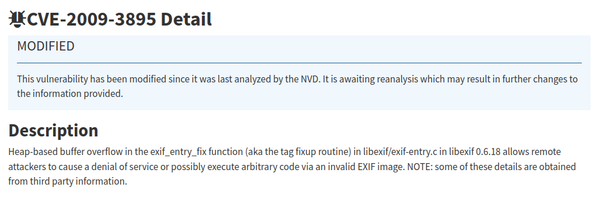

The description tells us that the vulnerability is in the `exif_entry_fix` function in the `libexif/exif-entry.c` in `libexif 0.6.18` version.

# Information Gathering
Searching through the internet we see that Exif is a standard format on various digital media such as images, videos and audio. [This pdf](https://exiv2.org/Exif2-2.PDF) goes into more details about it.

IFD (Image File Directory) can hold various metadata in the bytes of a jpg file.
The structure of IFD that we are interested is:
- 2 bytes for the Tag
- 2 bytes for the Type of the value, as in short, long, ASCII, etc.
- 4 bytes for the Count, the number of values.
- 4 bytes for the Offset of the Value, meaning the number you have to add at the start of [TIFF](https://en.m.wikipedia.org/wiki/TIFF) Header until the value is stored. 

An extensive list of tags can be found [here](https://exiftool.org/TagNames/EXIF.html)

The `libexif` is a Open Source library written in C so that other tools that want to extract and read exif can use.

This means that to properly test this library we ll need some tool that utilize the library.
Luckily in the github for libexif we can also find a cli tool called [exif](https://github.com/libexif/exif) that we could build and test.

To use the exif binary we pass as a cli argument an image and it will print out the various metadata it detected.
That means that the image and by extension it's metadata are controlled by the user.

Lets first see the tool in action with a regular jpg sample. (you do need to compile the binary first, we ll get on how to do that in a bit)

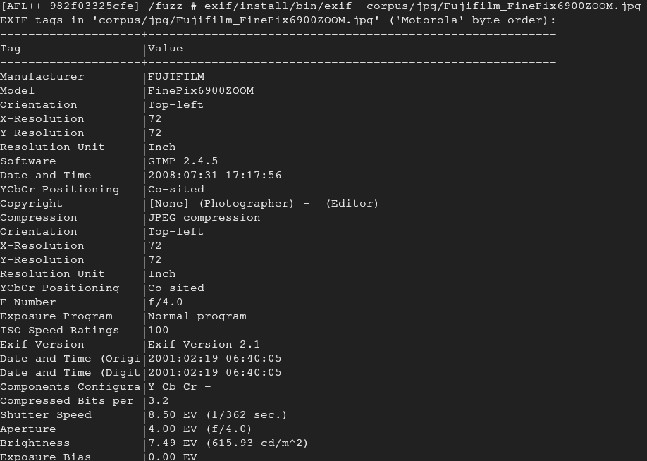

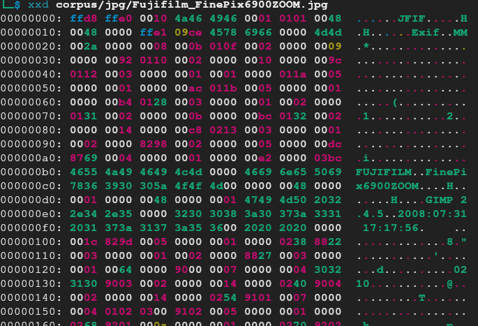

We have the `Exif \0 \0` magic byte that indicate the beginning of the metadata, followed by the two bytes that indicate byte order, MM for Motorola (Big Endian) and II for Intel (Little Endian).

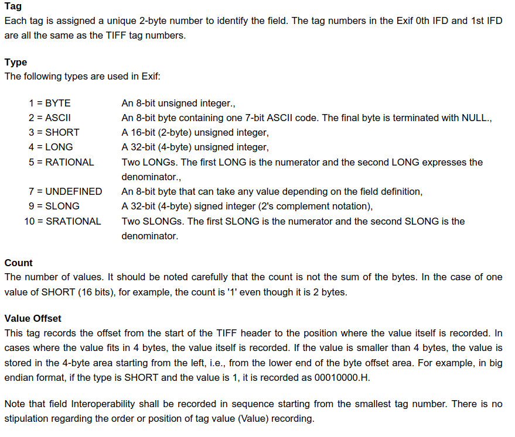
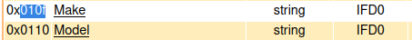

The `0x010f` is the Tag for Make/Manufacturer, the Type is `0x02` which means `ASCII`, `0x09` Count, which means the number of bytes in the string and lastly `0x92` is the offset where the value, in this case the string, is.
The start of the TIFF header is at the `MM`, which is `0x01e`.
Therefore the start of the string/value should be `0x01e + 0x92`, `0x0b0` and we can also confirm that the length of the string `FUJIFILM` is 9 bytes (plus the null byte).

So everything works as intended.

# Fuzzing
I prefer to do my fuzzing in a docker container.
That the default docker container provided by AFL++ will do, but any container can do if set up properly.

Once we start the container we move to the `/fuzz` directory.

I v written two bash scripts to automate the setup of the lab for our testing.

`build.sh` downloads and installs any dependencies needes for our project, alongside the vulnerable version and corpus samples for the fuzzing.
Executing it with the `FIX` env will download the later versions that fixed the bug so that we can compare them.

`fuzzing.sh` compiles the vulnerable software using AFL++ and initiates the fuzzing.
Similarly, passing the `FIX` env compiles the fixed version in the `fix` directory (if you used the build.sh).
Passing the `DEBUG` env compiles everything without AFL++ for when we need to test the program without it.

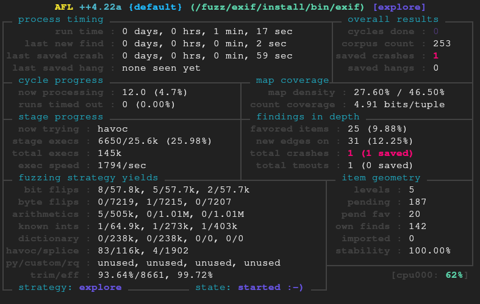

Our fuzzer identifies various crashes after a while. We can see it manually by executing the program with any of the crash files in the `out/default/crashes` directory.
We can rebuild the tools using the `DEBUG` env to see if it still crashes when it's compiled normally.

The error we see is

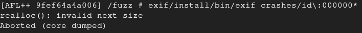

Lets look at the metadata for this file

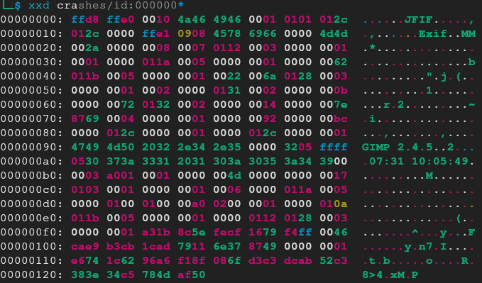

And lets try to run this with the `-d` flag for the debug messages (we could also try a newer version that doesn't crash without any flags).

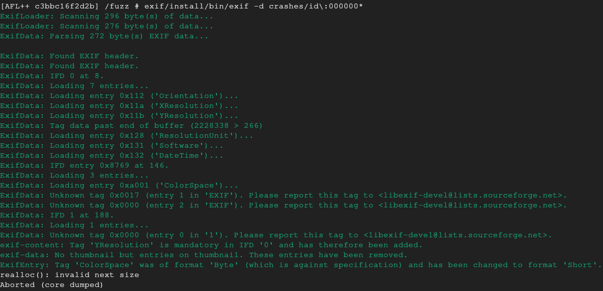

The last debug message was about how the `ColorSpace` entry was of format 'Byte' instead of 'Short' that was expected based on the specification.

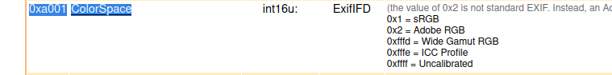
The `ColorSpace` Tag is `0xa001` and indeed the Type expected is `int16u` (short), but how is it in the actual file we got?

Looking back at the xxd output:
The Tag `0xa001` appears at the address `0x0b2`.
The next two bytes would be the Type, which is `0x01`. That means the Type is Byte.
The next four bytes would be the Count and that's `0x4d`.
The next four bytes after that is the Offset of the value and its `0x00`, that means it's the start of the TIFF header.

Based on the debugging information we suspect that the program tried to convert the type of `ColorSpace`from 'Byte' to 'Short' and that causes the crash.

Lets investigate the crash in a debugger.

# GDB
`gdb --args exif/install/bin/exif -d crashes/id\:000000*`
running the process until completion we get a SIGABRT.

Checking the backtrace:
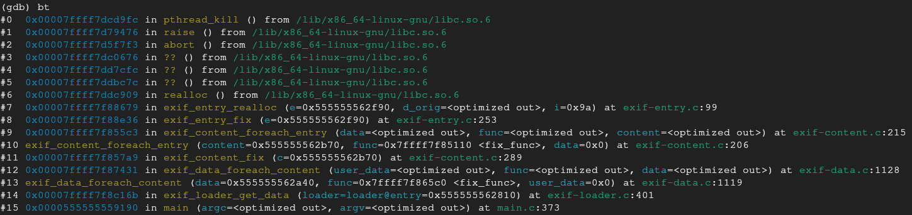

We see that the crash happens from the realloc wrapper that is called by `exif_entry_fix` function

Looking at the specific exif entry

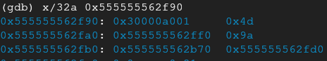

And following the source code for the `ExifEntry` struct (the type of 'e' in our case)

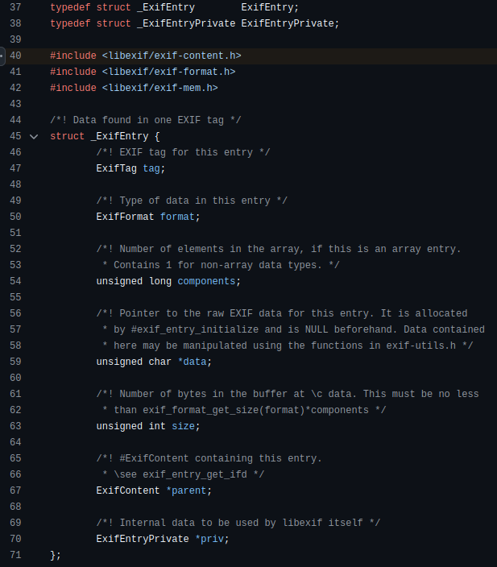

As we see ExifEntries are similar to the IFD structure, were tag is the same, type is called format, value is the data, and count is components.
Size in this case is the Count * Type.
The type here is short, which means 2 bytes, therefore `0x9a`.
Keep in mind that 3 is the number for the type s
Short in the specifications, but the actual size of Short is 2 bytes.

The entry->tag = `0xa001`.
The entry->format = 3 (SHORT)
The entry->components = `0x4d`
The entry->data = `0x555555562ff0`
The entry->size = `0x9a`
The entry->parent = `0x555555562b70`
The entry->priv = `0x555555562fd0`

This seems to somewhat track with what we saw from the bytes earlier for `ColorSpace`

# Code

We know that our program crashes when the `exif_entry_fix` function tries to realloc.
Let's look at the source code.

`exif_entry_fix` func in `exif-entry.c`

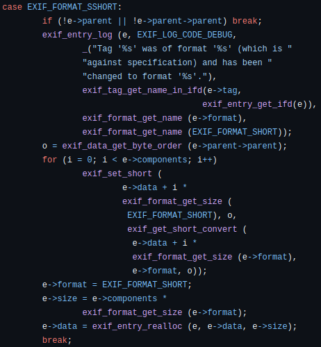

`exif_get_sshort` in `exif-utils.c`

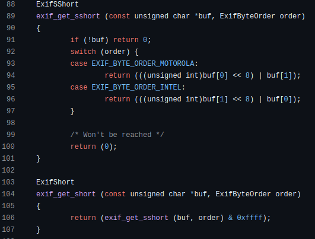

`exif_set_sshort `

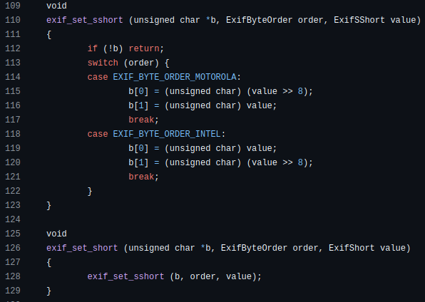

The `exif_set_short` is a wrapper for the `exif_set_sshort` which overwrites the first two bytes of the string passed to it, in this case e->data + i * size of SHORT, ie 2, with a value bitshifted a certain way depending on the byte order of the file. 
In this case the value is e->data + i * size of whatever the metadata says the format initially is.

Since these operations are happening on the preallocated chunk for the specific entry, based on the metadata provided by the file, in this case count is `0x4d` and type is BYTE, ie 1, which means `0x4d` and so a chunk of` 0x60` is used to store the value and heap chunk metadata.

But the process tries to convert the type from BYTE to SHORT because the tag is `ColorSpace` and it needs to follow the specifications, so it tries to overwrite up to a larger size, which ends up writing outside the heap chunk.

# The Bug
With all this lets get back to our debugger and examine the data closer.

The e->data entry:

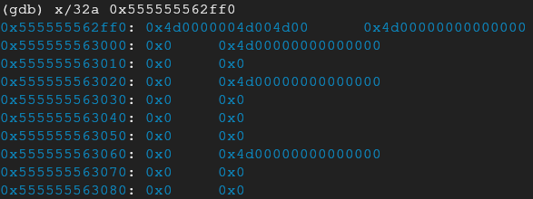

But looking at the metadata size for this particular chunk (0x8 bytes before the address)

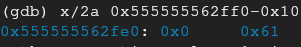

We see that the chunk should be `0x60` hex with the metadata, meaning `0x50`, as we expected. This means that the next chunk should start at the address `0x555555563040` and the metadata size for the next chunk should be in `-0x048`, which is zero as we see.

This happened because as we expected the process tried to set the values of a heap chunk of size `0x50` (without metadata) but the size it expected it to be was `0x9a`, overwriting the bytes of the next chunk.

When realloc tries to change the size of the chunk it will look up the next contiguous chunk in memory to see if its freed so it can merge it.

Lets look at the source code in glibc for `_int_realloc`

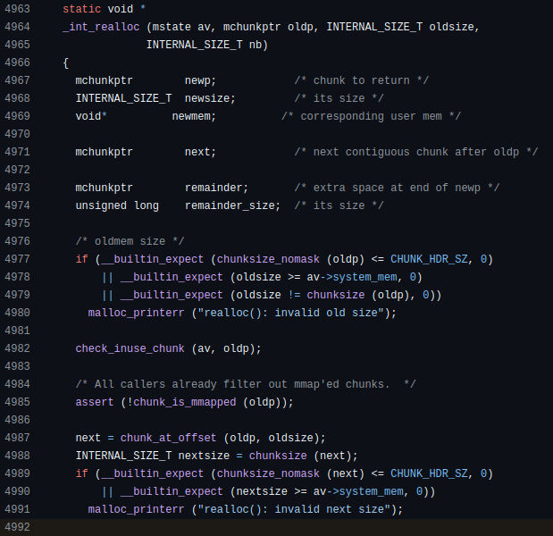

And this causes the process to abort because the next chunk size has 0 as chunk size because of the buffer overwrite in the heap.

# Remediation

The solution provided by the developers can be viewed in their [github commits](https://github.com/libexif/libexif/commit/ababc4a76457a3bab7f256cab9d7159fd4e25f90)
Instead of performing operations on the existing chunk, they create a new chunk first and then perform the operations on that.

We can compile the newer version 0.6.19 and test if the problem has been resolved.

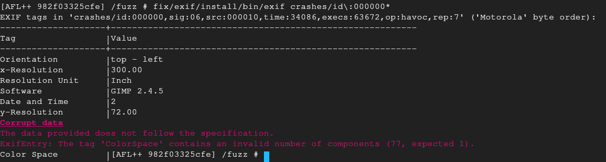

And indeed, no crashes. 
