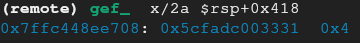
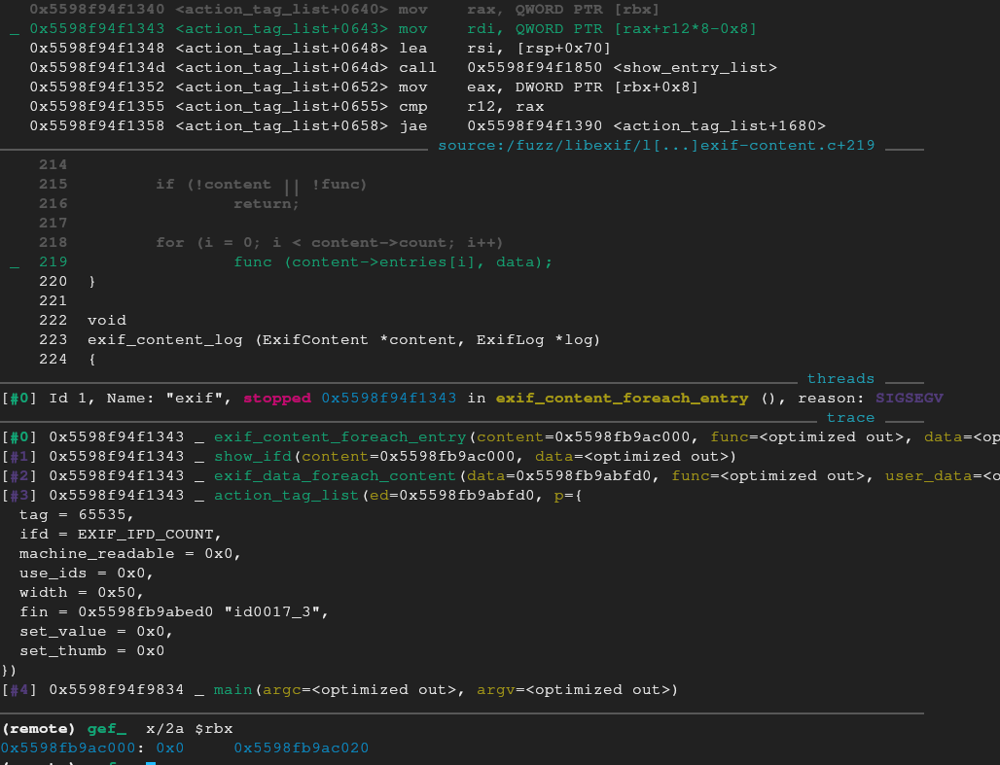

[CVE-2012-2814](https://nvd.nist.gov/vuln/detail/CVE-2012-2814)

We know that version 0.6.20 has some CVEs associated with it, let's try to fuzz it.

I made some changes to the bash scripts.
- `trim.sh` takes a corpus directory and makes all the samples unique as minimizes them. We need an afl++ compiled binary first.
- `build.sh` installs dependancies for the target library and binary we are fuzzing, plus GEF, plus tmux for multiple fuzzing sessions, plus pwntools. Passing the FIX env will do everything in a fix directory.
- `fuzzing.sh` can also take the FIX env, but it takes also arguments. BUILD in order to compile all necessary binaries, FUZZ to start a fuzzing session and CON to continue an existing session.

We also use ASAN in our fuzzing in a separate session. It's compiled in the `install_asan` directory. We use both of them with tmux. We can also use GNU screen instead, but tmux looks better.

The `install_dbg` directory holds a version of the binary that we ll use for debugging with our GDB.

I also wrote a python script to send the payload to the target binary and starts a gdb session.

Make sure to run the `trim.sh` first before the fuzzing so the corpus samples will be unique and small.

# Fuzzing

After a while we get a few crashes on the normal afl++compiled binary 

And a few for the asan compiled.

Let's look at a random crash through ASAN.

We get a lot of information.
It detected a Stack buffer overflow in `exif_entry_format_value` on line 558 and we also get the entire stack trace.

# Static analysis

Examination of the code on that line shows that it's inside a switch case for the format RATIONAL.

The code reads the 8 bytes from the entry data and interprets it as a rational number, ie numerator/denominator. Calculates the digits for the denominator and stores the string representation of the rational number up to that number of digits in a buffer.
Then uses strncat to concatenate the buffer to a val buffer that will hold the entire result, decreases the maximum allowed length we r allowed to write and repeat for the next 8 bytes in the buffer up until the number in entry c`omponents`, but the second time around and every time it repeats it also concatenates a coma and space to separate each value, decreasing the maxlen by two.

But in this case there are no checks, which means that for sufficiently large `components` value maxlen could loop around and underflow to a large number.
the next time it writes to a buffer up until maxlen it would end up overflowing the buffer.

For one maxlen decrement we see that the program verifies that the value didn't overflow, otherwise it breaks.

# Dynamic analysis 

Let's try to see this in a debugger.

After enough iterations maxlen becomes 1.
When the program tries to subtract two from it it will get, 1-2 would underflow to 0x7FFFFFFF

Comparing the data for this iteration and the bytes in the exif file we see that the bytes here are in the address `0x396` in the exif file.

Let's look at the val buffer now, before the buffer overflow.
`x/130a val`

After the write we see that the address `-708` is partially overwritten with the bytes `0x003331`

The epilogue for the `show_entry_list` pops a few registers after it unwinds the stack.

The values on top of the stack after that will be these:

The program tries to dereference the value in rbx which used to be a heap address, but since we overwrote it its an invalid address, causing a segfault.

The `content` value used to be `0x5cfadcf8c060` but its 3 least significant bytes got overwritten with `0x003331` which is ASCII for `13` from the overflow of the buffer.

Now that we understand why the program crashes with this input file, lets see how we can gain control flow by manipulating the input file.

# Exploit 

Since we control the e->data we can control what gets written in the buffers. But unfortunately we can't write any bytes we want. It needs to be ASCII numbers and it needs to end in a null byte because of how strncat works.

What we could do is use the terminating null byte and overwrite the last byte of the heap address that gets dereferenced later.
Overwriting the least significant byte with null would still point to a legitimate heap address.

Since we know the address from the exif file that gets written to the buffer is at the address `0x396` we could edit the bytes so that the data we get will be 9 whatever digits (lets say 1s) digits for numerator and the number one for the denominator so it doesn't change our numerator.

`xxd out_bak/master/crashes/id\:000017* > id.hex`

The hex for a number, of nine 1s is `0x069f6bc7`

We edit the bytes. Since the byteorder is MM (Motorola, aka big endian)

to apply the changes we run `xxd -r id.hex id0017_3`

Now when we reach the point of the overflow we see that the address we want has 00 as the least significant byte.

Once the `show_entry_list` finishes the `rbx` is overwritten with the new address

Unfortunately this new rbx address isn't fully controlled by us and the value it points to is zero, so later on when trying to dereference 0x0 will also segfault.

# Remediation
The problem stems from the integer underflow in the `exif_entry_format_value` because it doesn't properly checks if the value is large enough to subtract 2.
Adding proper validation to prevent the underflow would also prevent the stack smashing.

# Conclusion
We managed to find an integer underflow that resulted to a stack buffer overflow.

By controlling the bytes of the exif file we were able to take advantage of the overflow and rewrote an address to another and changed the execution flow.

Unfortunately because of the constraints of what we can actually write we still got a crash later down the code.